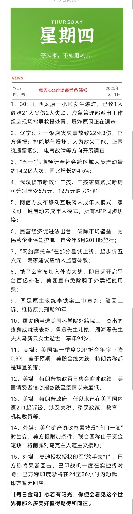
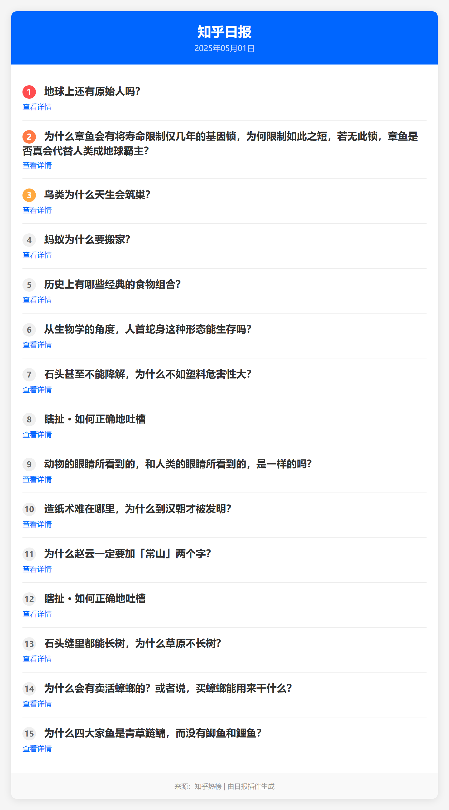
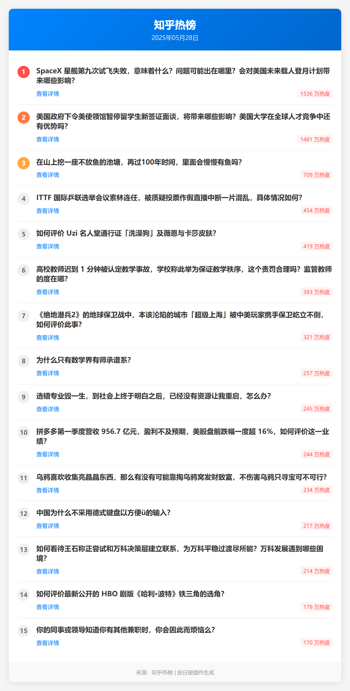
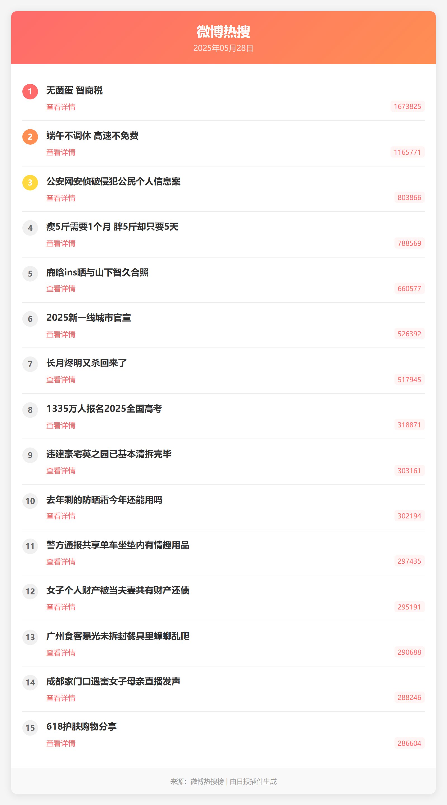
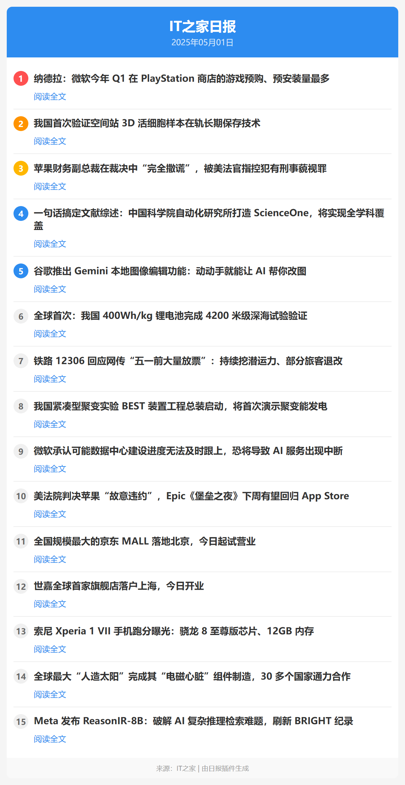
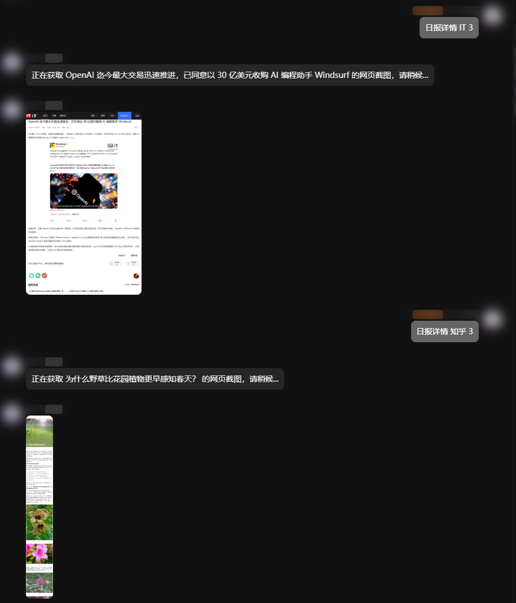

<div align="center">

# 多源日报 / Multi-Source Daily

_✨ 一个聚合多种日报源的NoneBot2插件，支持定时发送和多API源 ✨_


<a href="https://pypi.python.org/pypi/nonebot-plugin-multi-source-daily">
    
</a>

<a href="https://nonebot.dev/store/plugins/plugin/nonebot-plugin-multi-source-daily">
    
</a>

</div>

## 📖 介绍

多源日报是一个基于 [NoneBot2](https://github.com/nonebot/nonebot2) 的插件，提供多种日报信息的聚合服务，包括60秒看世界、知乎日报、知乎热榜、微博热搜、IT之家日报、摸鱼日报、历史上的今天等。

### 特色功能

- **定时发送功能**：支持设置定时任务，每天自动发送日报到指定群聊
- **多种展示格式**：支持图片和文本两种展示方式
- **详情查看功能**：支持查看日报中特定新闻的详细内容
- **API源管理**：提供完善的API源管理功能，可以启用/禁用/重置特定API源

## 💿 安装

### 使用 nb-cli 安装（推荐）

```bash
nb plugin install nonebot-plugin-multi-source-daily
```

### 使用 pip 安装

```bash
# 基础安装
pip install nonebot-plugin-multi-source-daily

# 安装包含图片优化功能的完整版本
pip install nonebot-plugin-multi-source-daily[image]
```

### 手动安装

```bash
git clone https://github.com/webjoin111/nonebot-plugin-multi-source-daily.git
cd nonebot-plugin-multi-source-daily
pip install .
```

## ⚙️ 配置

在 NoneBot2 全局配置文件（`.env` 或 `.env.prod`）中添加以下配置：

```dotenv
# 日报缓存过期时间（秒），默认3600秒
DAILY_NEWS_CACHE_EXPIRE=3600

# API请求超时时间（秒），默认10秒
DAILY_NEWS_TIMEOUT=10.0

# API请求最大重试次数，默认3次
DAILY_NEWS_MAX_RETRIES=3

# 是否启用API自动故障转移，默认为True
DAILY_NEWS_AUTO_FAILOVER=true

# 默认日报展示格式，可选值：image、text，默认为image
DAILY_NEWS_DEFAULT_FORMAT=image

# 微博Cookie，用于获取微博详情内容
WEIBO_COOKIE="" 

```

## 🚀 功能列表

本插件支持以下日报类型：

| 日报类型 | 别名 | 默认API源数量 | 支持日报详情 |
|---------|------|--------------|-------------|
| 60秒 | 60s | 2 | ❌ |
| 知乎日报 | - | 1 | ✅ |
| 知乎热榜 | - | 1 | ❌ |
| 微博热搜 | weibo、微博 | 2 | ✅ |
| IT之家 | it之家、it、IT | 1 | ✅ |
| 摸鱼日历 | 摸鱼、moyu | 3 | ❌ |
| 历史上的今天 | 历史、today | 1 | ❌ |

## 📸 日报示例

以下是各类日报的效果展示：

### 60秒看世界

<div align="center">
  
</div>

### 知乎日报

<div align="center">
  
</div>

### 知乎热榜

<div align="center">
  
</div>

### 微博热搜

<div align="center">
  
</div>

### 摸鱼日报

<div align="center">
  
</div>

### IT之家日报

<div align="center">
  
</div>

### 历史上的今天

<div align="center">
  
</div>

### 日报详情

<div align="center">
  
</div>

## 🎮 使用指南

### 基础命令

```
日报 [类型] [-f 格式] [--force] [-a API索引]
  - 获取指定类型的日报信息
  - 可选格式: image(图片), text(文字)
  - --force 强制刷新，不使用缓存
  - -a 参数可指定使用特定的API源索引
  - 例如: 日报 60s -f text
  - 例如: 日报 知乎热榜 --force
  - 例如: 日报 微博热搜 -a 2
  - 例如: 日报 历史上的今天

日报详情 [类型] [数字]
  - 获取指定日报类型中特定序号新闻的网页截图
  - 支持微博热搜网页截图功能
  - 例如: 日报详情 ithome 3
  - 例如: 日报详情 微博热搜 1
  - 仅对有网页链接的日报类型有效

[数字]
  - 回复日报图片并发送数字，获取对应序号新闻的网页截图
  - 例如: 回复IT之家日报图片 + 5
  - 例如: 回复微博热搜日报图片 + 1
  - 仅对有网页链接的日报类型有效

日报列表
  - 显示所有支持的日报类型及其详细信息
```

### 定时日报命令

```
定时日报 设置 [类型] [HH:MM或HHMM] [-g 群号] [-all] [-f 格式]
  - 设置定时发送指定类型的日报(仅限超级用户)
  - -g 参数可指定特定群号
  - -all 参数将对所有群生效
  - -f 参数可设置格式(image/text)
  - 例如: 定时日报 设置 60s 08:00 -g 123456 -f text
  - 例如: 定时日报 设置 知乎热榜 09:30 -all
  - 例如: 定时日报 设置 微博热搜 18:00

定时日报 取消 [类型] [-g 群号] [-all]
  - 取消本群或指定群的定时日报(仅限超级用户)
  - 例如: 定时日报 取消 60秒 -g 123456

定时日报 查看 [-g 群号] [-all]
  - 查看当前群的日报订阅情况
  - -g 和 -all 参数仅限超级用户使用
  - 默认使用图片方式显示
  - 例如: 定时日报 查看 -all
```

### 缓存管理命令（仅限超级用户）

```
日报缓存 [reset|重置]
  - 查看或重置日报缓存
  - 不带参数时显示缓存状态
  - 使用reset或重置参数重置所有缓存
  - 例如: 日报缓存
  - 例如: 日报缓存 reset
```

### API源管理命令（仅限超级用户）

```
日报API [-t]
  - 查看所有日报API源及其状态
  - -t 使用文本方式显示，默认为图片

日报API 启用 [类型] [序号]
  - 启用指定的日报API源
  - 例如: 日报API 启用 60秒 2

日报API 禁用 [类型] [序号]
  - 禁用指定的日报API源
  - 例如: 日报API 禁用 60秒 2

日报API 重置 [类型]
  - 重置指定日报类型的API源状态
  - 类型可以是: 60秒, 知乎日报, 知乎热榜, 微博热搜, IT之家, 摸鱼日历, 历史上的今天, all
  - 例如: 日报API 重置 微博热搜

日报API 重置 -a
  - 重置所有API源状态
  - 当所有日报来源均不可用时使用
```


## 🔍 故障排除

### 常见问题

1. **日报获取失败**
   - 检查网络连接是否正常
   - 使用 `日报API 重置 -a` 命令重置所有API源状态
   - 检查API源是否可用，可能需要更新API源配置
   - 尝试使用 `-a` 参数指定不同的API源

2. **定时任务不生效**
   - 检查机器人是否一直在线
   - 检查定时任务配置是否正确
   - 确认机器人有发送消息的权限
   - 重启机器人重新加载定时任务配置

3. **图片渲染失败**
   - 确保 nonebot-plugin-htmlrender 插件正确安装并配置
   - 检查系统是否安装了浏览器依赖
   - 尝试使用文本格式：`日报 60s -f text`

4. **图片优化功能不可用**
   - 确保已安装 Pillow 库：`pip install nonebot-plugin-multi-source-daily[image]`
   - 如果安装 Pillow 时出错，可能需要安装系统依赖，详见[可选依赖](#可选依赖)部分

5. **缓存问题**
   - 如果获取到过期数据，可以等待缓存自动过期（默认1小时）
   - 使用 `--force` 参数强制刷新，不使用缓存
   - 使用 `日报缓存 --reset` 命令重置所有缓存

6. **权限问题**
   - 确认机器人在群聊中有发送消息和图片的权限
   - 超级用户命令需要在配置文件中正确设置 SUPERUSERS

### 日志说明

插件会在以下情况输出日志：

- API请求失败时
- API源状态变更时
- 定时任务执行时
- 插件初始化时

## 🛠️ 高级配置

### 数据存储

插件使用 nonebot-plugin-localstore 管理数据存储，数据文件位于：

- 配置文件：`~/.nonebot/nonebot-plugin-multi-source-daily/config/`
- 缓存文件：`~/.nonebot/nonebot-plugin-multi-source-daily/cache/`
- 数据文件：`~/.nonebot/nonebot-plugin-multi-source-daily/data/`

### 版本兼容性

- 本插件从 v0.2.0 开始兼容 pydantic v1 和 v2 版本
- 支持 NoneBot2 v2.3.0 及以上版本
- 依赖的插件版本限制已放宽，支持更多环境

## 🔧 依赖

### 必须依赖

- Python >= 3.8
- NoneBot2 >= 2.3.0
- nonebot-adapter-onebot >= 2.0.0
- nonebot-plugin-alconna >= 0.30.0
- nonebot-plugin-apscheduler >= 0.3.0
- nonebot-plugin-htmlrender >= 0.2.0
- nonebot-plugin-localstore >= 0.4.0
- httpx >= 0.23.0, < 1.0.0
- pydantic (兼容 v1 和 v2 版本)

### 可选依赖

- **Pillow**：用于图片优化功能，可以减小图片大小，提高发送速度

  ```bash
  pip install nonebot-plugin-multi-source-daily[image]
  ```

  在某些环境中，可能需要先安装系统依赖：

  CentOS/RHEL:

  ```bash
  sudo yum install python-devel zlib-devel libjpeg-turbo-devel
  ```

  Ubuntu/Debian:

  ```bash
  sudo apt-get install python3-dev zlib1g-dev libjpeg-dev
  ```

## 🙏 鸣谢

- [NoneBot2](https://github.com/nonebot/nonebot2)：优秀的聊天机器人框架
- [nonebot-plugin-alconna](https://github.com/nonebot/plugin-alconna)：强大的命令解析插件
- [nonebot-plugin-htmlrender](https://github.com/nonebot/plugin-htmlrender)：网页渲染插件
- [nonebot-plugin-apscheduler](https://github.com/nonebot/plugin-apscheduler)：定时任务插件
- [nonebot-plugin-localstore](https://github.com/nonebot/plugin-localstore)：本地存储插件

## 📝 更新日志

### v0.3.0

#### ✨ 新功能

- **新增摸鱼日历多源支持**：丰富摸鱼日历的API源，提供更稳定的服务
- **新增微博热搜详情获取**：支持通过WEIBO_COOKIE获取完整微博内容
- **优化微博热搜网页截图**：提供更精准的截图效果，支持高分辨率截图
- **新增微博热搜新API解析器**：提高数据获取稳定性

#### ♻️ 重构优化

- **统一新闻源处理器**：集中管理IT之家、知乎、微博等处理器，优化代码结构
- **重构utils目录结构**：将通用工具函数和存储类迁移至utils/core模块
- **引入通用文件缓存机制**：为截图和API响应提供更灵活的缓存管理
- **简化命令参数**：移除冗余的类型和-a参数，简化定时日报和缓存命令
- **移除修复命令**：简化定时日报管理，移除不必要的修复功能

#### 🔧 配置增强

- **新增WEIBO_COOKIE配置项**：支持微博详情和高级截图功能
- **优化日报和API源信息显示效果**：提供更好的视觉体验

### v0.2.6

#### 🎯 优化改进

- **优化配置管理**：将配置常量全部迁移至config目录，提升代码组织结构
- **增加微博热搜日报**：新增微博热搜作为日报源类型，支持获取实时热搜榜单
- **新增60s API源**：添加60s API (<https://60s-api.viki.moe/v2/60s>) 作为第二个新闻源，支持JSON格式新闻渲染为图片
- **新增知乎热榜功能**：添加知乎热榜作为新的日报源类型，支持获取知乎实时热榜
- **优化Usage内容**：提供更详细和全面的使用文档，包含所有可用命令的完整说明

#### 🔧 功能增强

- **API源参数支持**：日报命令支持-a参数指定特定API源，绕过缓存获取最新数据
- **中文命令别名**：更新命令别名为中文名称 - 摸鱼日历、60秒、IT之家等，提升用户体验
- **模板样式优化**：统一各新闻模板样式，减少边距和白边，保持一致的视觉效果
- **缓存策略优化**：支持API源特定缓存，避免不同源之间的缓存冲突


## �📄 开源许可

本项目采用 [MIT](./LICENSE) 许可证开源。

```
Copyright (c) 2023 webjoin111

Permission is hereby granted, free of charge, to any person obtaining a copy
of this software and associated documentation files (the "Software"), to deal
in the Software without restriction, including without limitation the rights
to use, copy, modify, merge, publish, distribute, sublicense, and/or sell
copies of the Software, and to permit persons to whom the Software is
furnished to do so, subject to the following conditions:

The above copyright notice and this permission notice shall be included in all
copies or substantial portions of the Software.

THE SOFTWARE IS PROVIDED "AS IS", WITHOUT WARRANTY OF ANY KIND, EXPRESS OR
IMPLIED, INCLUDING BUT NOT LIMITED TO THE WARRANTIES OF MERCHANTABILITY,
FITNESS FOR A PARTICULAR PURPOSE AND NONINFRINGEMENT. IN NO EVENT SHALL THE
AUTHORS OR COPYRIGHT HOLDERS BE LIABLE FOR ANY CLAIM, DAMAGES OR OTHER
LIABILITY, WHETHER IN AN ACTION OF CONTRACT, TORT OR OTHERWISE, ARISING FROM,
OUT OF OR IN CONNECTION WITH THE SOFTWARE OR THE USE OR OTHER DEALINGS IN THE
SOFTWARE.
```
