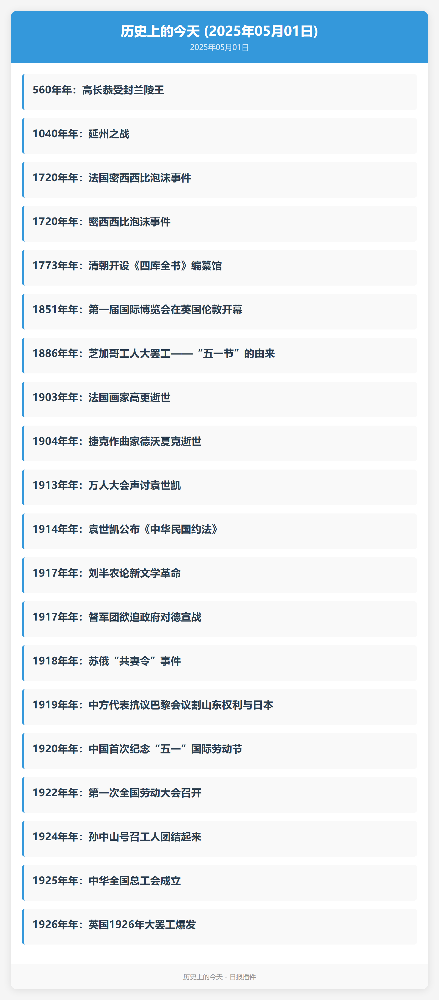

<div align="center">

# 多源日报 / Multi-Source Daily

_✨ 一个聚合多种日报源的NoneBot2插件，支持定时发送和多API源 ✨_


<a href="https://pypi.python.org/pypi/nonebot-plugin-multi-source-daily">
    
</a>

<a href="https://nonebot.dev/store/plugins/plugin/nonebot-plugin-multi-source-daily">
    
</a>

</div>

## 📖 介绍

多源日报是一个基于 [NoneBot2](https://github.com/nonebot/nonebot2) 的插件，提供多种日报信息的聚合服务，包括60秒看世界、知乎日报、IT之家日报、摸鱼日报、历史上的今天等。

### 特色功能

- **定时发送功能**：支持设置定时任务，每天自动发送日报到指定群聊
- **多种展示格式**：支持图片和文本两种展示方式
- **详情查看功能**：支持查看日报中特定新闻的详细内容
- **API源管理**：提供完善的API源管理功能，可以启用/禁用/重置特定API源

## 💿 安装

### 使用 nb-cli 安装（推荐）

```bash
nb plugin install nonebot-plugin-multi-source-daily
```

### 使用 pip 安装

```bash
# 基础安装
pip install nonebot-plugin-multi-source-daily

# 安装包含图片优化功能的完整版本
pip install nonebot-plugin-multi-source-daily[image]
```

### 手动安装

```bash
git clone https://github.com/webjoin111/nonebot-plugin-multi-source-daily.git
cd nonebot-plugin-multi-source-daily
pip install .
```

## ⚙️ 配置

在 NoneBot2 全局配置文件（`.env` 或 `.env.prod`）中添加以下配置：

```dotenv
# 日报缓存过期时间（秒），默认3600秒
DAILY_NEWS_CACHE_EXPIRE=3600

# API请求超时时间（秒），默认10秒
DAILY_NEWS_TIMEOUT=10.0

# API请求最大重试次数，默认3次
DAILY_NEWS_MAX_RETRIES=3

# 是否启用API自动故障转移，默认为True
DAILY_NEWS_AUTO_FAILOVER=true

# 默认日报展示格式，可选值：image、text，默认为image
DAILY_NEWS_DEFAULT_FORMAT=image
```

## 🚀 功能列表

本插件支持以下日报类型：

| 日报类型 | 说明 | 默认API源数量 |
|---------|------|--------------|
| 60s | 60秒看世界 | 1 |
| 知乎日报 | 知乎日报 | 1 |
| moyu | 摸鱼日报 | 1 |
| IT之家 | IT之家日报 | 1 |
| 历史上的今天 | 历史上的今天 | 1 |

## 📸 日报示例

以下是各类日报的效果展示：

### 60秒看世界

<div align="center">
  
</div>

### 知乎日报

<div align="center">
  
</div>

### 摸鱼日报

<div align="center">
  
</div>

### IT之家日报

<div align="center">
  
</div>

### 历史上的今天

<div align="center">
  
</div>

### 日报详情

<div align="center">
  
</div>

## 🎮 使用指南

### 基础命令

```
日报 [类型] [-f 格式]
  - 获取指定类型的日报信息
  - 可选格式: image(图片), text(文字)
  - 例如: 日报 60s -f text
  - 例如: 日报 历史上的今天

日报详情 [类型] [数字]
  - 获取指定日报类型中特定序号新闻的网页截图
  - 例如: 日报详情 IT 3
  - 仅对有网页链接的日报类型有效

[数字]
  - 回复日报图片并发送数字，获取对应序号新闻的网页截图
  - 例如: 回复IT之家日报图片 + 5
  - 仅对有网页链接的日报类型有效

日报列表
  - 显示所有支持的日报类型
```

### 定时日报命令

```
定时日报 设置 [类型] [HH:MM或HHMM] [-g 群号] [-all] [-f 格式]
  - 设置定时发送指定类型的日报(仅限超级用户)
  - -g 参数可指定特定群号
  - -all 参数将对所有群生效
  - -f 参数可设置格式(image/text)
  - 例如: 定时日报 设置 60s 08:00 -g 123456 -f text
  - 例如: 定时日报 设置 知乎 09:30 -all

定时日报 取消 [类型] [-g 群号] [-all]
  - 取消本群或指定群的定时日报(仅限超级用户)
  - 例如: 定时日报 取消 60s -g 123456

定时日报 查看 [-g 群号] [-all] [-t]
  - 查看当前群的日报订阅情况
  - -g 和 -all 参数仅限超级用户使用
  - -t 使用文本方式显示，默认为图片
  - 例如: 定时日报 查看 -all -t

定时日报 修复 [-a]
  - 修复日报系统，重新加载定时任务配置
  - -a 参数将重置所有定时任务配置
```

### API源管理命令（仅限超级用户）

```
日报API [-t]
  - 查看所有日报API源及其状态
  - -t 使用文本方式显示，默认为图片

日报API 启用 [类型] [序号]
  - 启用指定的日报API源
  - 例如: 日报API 启用 60s 2

日报API 禁用 [类型] [序号]
  - 禁用指定的日报API源
  - 例如: 日报API 禁用 60s 2

日报API 重置 [类型]
  - 重置指定日报类型的API源状态
  - 类型可以是: 60s, 知乎, moyu, ithome, 历史上的今天, all
  - 例如: 日报API 重置 知乎

日报API 重置 -a
  - 重置所有API源状态
  - 当所有日报来源均不可用时使用
```

## 📝 API源配置

本插件默认配置了多个API源，如需自定义API源，可以在全局配置文件中添加以下配置：

```python
# 60秒看世界API源
DAILY_NEWS_60S_APIS=[
    {"url": "https://api.southerly.top/api/60s", "priority": 2, "parser": "binary_image"}
]

# 知乎日报API源
DAILY_NEWS_ZHIHU_APIS=[
    {"url": "https://api.vvhan.com/api/hotlist/zhihuDay", "priority": 1, "parser": "vvhan"}
]

# 摸鱼日报API源
DAILY_NEWS_MOYU_APIS=[
    {"url": "https://api.vvhan.com/api/moyu", "priority": 1, "parser": "binary_image"}
]

# IT之家日报API源
DAILY_NEWS_ITHOME_APIS=[
    {"url": "https://www.ithome.com/rss/", "priority": 1, "parser": "rss"}
]

# 历史上的今天API源
DAILY_NEWS_HISTORY_APIS=[
    {"url": "https://api.03c3.cn/api/history", "priority": 1, "parser": "history_today"}
]
```

## 🔍 故障排除

### 常见问题

1. **日报获取失败**
   - 检查网络连接是否正常
   - 使用 `日报API 重置 -a` 命令重置所有API源状态
   - 检查API源是否可用，可能需要更新API源配置

2. **定时任务不生效**
   - 检查机器人是否一直在线
   - 使用 `定时日报 修复` 命令重新加载定时任务配置
   - 检查定时任务配置是否正确

3. **图片渲染失败**
   - 确保 nonebot-plugin-htmlrender 插件正确安装并配置
   - 检查系统是否安装了浏览器依赖

4. **图片优化功能不可用**
   - 确保已安装 Pillow 库：`pip install nonebot-plugin-multi-source-daily[image]`
   - 如果安装 Pillow 时出错，可能需要安装系统依赖，详见[可选依赖](#可选依赖)部分

### 日志说明

插件会在以下情况输出日志：

- API请求失败时
- API源状态变更时
- 定时任务执行时
- 插件初始化时

## 🛠️ 高级配置

### 数据存储

插件使用 nonebot-plugin-localstore 管理数据存储，数据文件位于：

- 配置文件：`~/.nonebot/nonebot-plugin-multi-source-daily/config/`
- 缓存文件：`~/.nonebot/nonebot-plugin-multi-source-daily/cache/`
- 数据文件：`~/.nonebot/nonebot-plugin-multi-source-daily/data/`

### 版本兼容性

- 本插件从 v0.2.0 开始兼容 pydantic v1 和 v2 版本
- 支持 NoneBot2 v2.3.0 及以上版本
- 依赖的插件版本限制已放宽，支持更多环境

## 🔧 依赖

### 必须依赖

- Python >= 3.8
- NoneBot2 >= 2.3.0
- nonebot-adapter-onebot >= 2.0.0
- nonebot-plugin-alconna >= 0.30.0
- nonebot-plugin-apscheduler >= 0.3.0
- nonebot-plugin-htmlrender >= 0.2.0
- nonebot-plugin-localstore >= 0.4.0
- httpx >= 0.23.0, < 1.0.0
- pydantic (兼容 v1 和 v2 版本)

### 可选依赖

- **Pillow**：用于图片优化功能，可以减小图片大小，提高发送速度

  ```bash
  pip install nonebot-plugin-multi-source-daily[image]
  ```

  在某些环境中，可能需要先安装系统依赖：

  CentOS/RHEL:

  ```bash
  sudo yum install python-devel zlib-devel libjpeg-turbo-devel
  ```

  Ubuntu/Debian:

  ```bash
  sudo apt-get install python3-dev zlib1g-dev libjpeg-dev
  ```

## 🙏 鸣谢

- [NoneBot2](https://github.com/nonebot/nonebot2)：优秀的聊天机器人框架
- [go-cqhttp](https://github.com/Mrs4s/go-cqhttp)：稳定可靠的 CQHTTP 实现
- [nonebot-plugin-alconna](https://github.com/nonebot/plugin-alconna)：强大的命令解析插件
- [nonebot-plugin-htmlrender](https://github.com/nonebot/plugin-htmlrender)：网页渲染插件
- [nonebot-plugin-apscheduler](https://github.com/nonebot/plugin-apscheduler)：定时任务插件
- [nonebot-plugin-localstore](https://github.com/nonebot/plugin-localstore)：本地存储插件

## 📄 开源许可

本项目采用 [MIT](./LICENSE) 许可证开源。

```
Copyright (c) 2023 webjoin111

Permission is hereby granted, free of charge, to any person obtaining a copy
of this software and associated documentation files (the "Software"), to deal
in the Software without restriction, including without limitation the rights
to use, copy, modify, merge, publish, distribute, sublicense, and/or sell
copies of the Software, and to permit persons to whom the Software is
furnished to do so, subject to the following conditions:

The above copyright notice and this permission notice shall be included in all
copies or substantial portions of the Software.

THE SOFTWARE IS PROVIDED "AS IS", WITHOUT WARRANTY OF ANY KIND, EXPRESS OR
IMPLIED, INCLUDING BUT NOT LIMITED TO THE WARRANTIES OF MERCHANTABILITY,
FITNESS FOR A PARTICULAR PURPOSE AND NONINFRINGEMENT. IN NO EVENT SHALL THE
AUTHORS OR COPYRIGHT HOLDERS BE LIABLE FOR ANY CLAIM, DAMAGES OR OTHER
LIABILITY, WHETHER IN AN ACTION OF CONTRACT, TORT OR OTHERWISE, ARISING FROM,
OUT OF OR IN CONNECTION WITH THE SOFTWARE OR THE USE OR OTHER DEALINGS IN THE
SOFTWARE.
```
